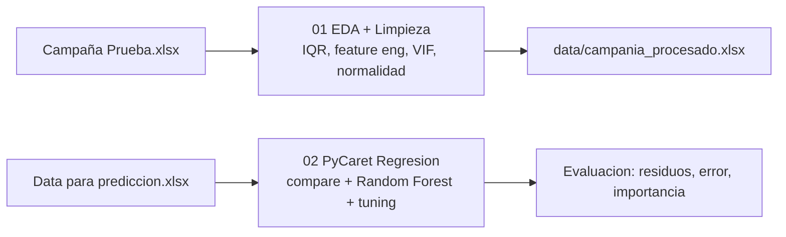

# Poultry Campaign Yield Model — Regresión (EDA + PyCaret)

Predicción del rendimiento de campañas **avícolas** —la variable `% total primera`— a partir de variables de producción (pesos por día de crecida, índices ICA/IEP, mortalidad). El proyecto está dividido en dos notebooks: limpieza/EDA y modelado con **PyCaret**.

## Contexto

En producción avícola, anticipar el porcentaje de aves de "primera" calidad de una campaña permite planificar ventas, precios y logística. El reto es limpiar datos ruidosos (outliers, alta cardinalidad de proveedores) y elegir un modelo que capture relaciones no lineales.

## Objetivo

Construir un pipeline reproducible que (1) limpie y explore los datos con rigor estadístico y (2) entrene y afine un modelo de regresión que prediga `% total primera`, comparando algoritmos automáticamente con PyCaret.

## Arquitectura



## Stack

| Categoría | Herramientas |
|---|---|
| Lenguaje | Python |
| EDA / estadística | pandas, NumPy, SciPy, statsmodels (VIF, Shapiro, ANOVA) |
| Modelado | PyCaret (regresión), scikit-learn (Random Forest) |
| Visualización | Matplotlib, Seaborn |
| Entorno | Jupyter Notebook |

## Estructura del proyecto

```
poultry-campaign-yield-model/
├── data/                       # (no versionado) datasets de entrada y salida
├── 01_eda_limpieza.ipynb       # EDA -> outliers (IQR) -> feature eng -> baseline lineal -> export
├── 02_modelo_pycaret.ipynb     # PyCaret: compare_models -> Random Forest -> tuning -> evaluacion
├── requirements.txt
└── README.md
```

## Ejecución

1. Clona el repositorio: `git clone https://github.com/Alvaro192023/poultry-campaign-yield-model.git`
2. Instala dependencias: `pip install -r requirements.txt`
3. Coloca los datasets en `data/` (`Campaña Prueba.xlsx` para el notebook 1; el dataset con `% total primera` para el notebook 2).
4. Ejecuta `01_eda_limpieza.ipynb` (genera `data/campania_procesado.xlsx`) y luego `02_modelo_pycaret.ipynb`.

## Resultados e impacto

- Limpieza rigurosa: tratamiento de outliers por **IQR (clipping)**, reducción de cardinalidad de proveedores y chequeos de **normalidad (Shapiro)** y **multicolinealidad (VIF)**.
- Comparación automática de modelos con PyCaret y **Random Forest afinado** por MAPE/MAE.
- Gráficas de residuos, error e **importancia de variables** para interpretar los drivers del rendimiento.

## Próximos pasos

- Validar con datos de nuevas campañas y comparar contra Gradient Boosting / XGBoost.
- Registrar el modelo para predicción en producción.

## Licencia y contacto

MIT. Álvaro Villanueva Kobayashi — alvarovillakoba515@gmail.com · [GitHub](https://github.com/Alvaro192023)
